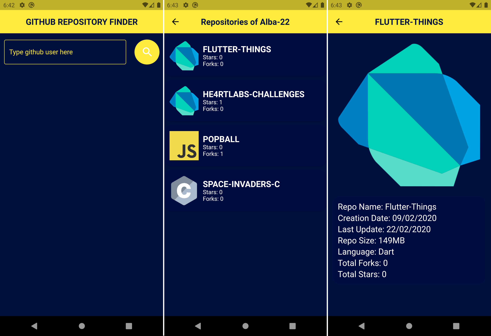

# github_repos
This app have the objective to receive a input from the user, a name of a github user, and show the public repositories of that user, along with some information, such as stars, forks, and so on.

### Main knowledges from this app:
* Simple validation in TextFormField
* Request from an API using HTTP protocol
* JSON Serialization
* Navigation through pages